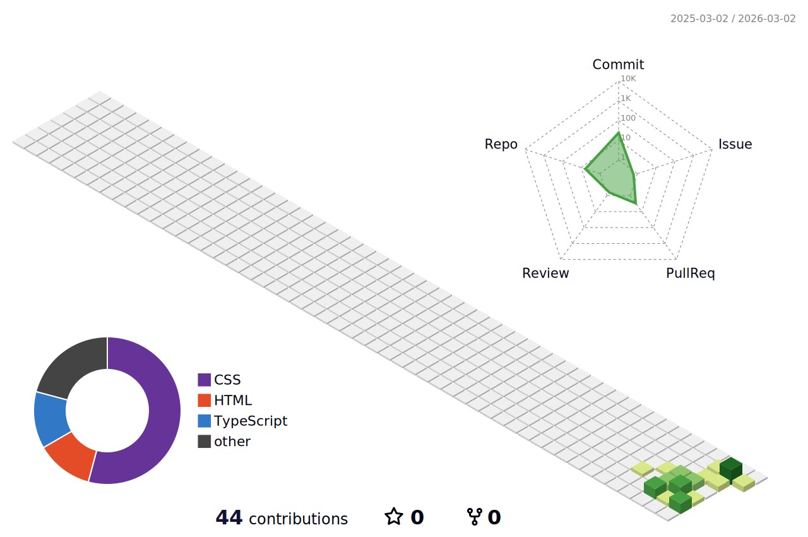

# 👋 Hi, I'm Prashant Srivastav

I am a Software Engineer Trainee at **IPH Technologies**, passionate about software development and quality assurance. I actively work on building real-world applications while continuously improving my technical skills. With experience in software testing, bug reporting, and a strong understanding of SDLC and Agile methodologies, I focus on writing clean, scalable, and efficient code. I am particularly interested in backend development and problem-solving, and I am always eager to learn new technologies and contribute to impactful projects. Based in India, I believe in continuous improvement and follow the principle: *“Code. Debug. Improve. Repeat.”*

